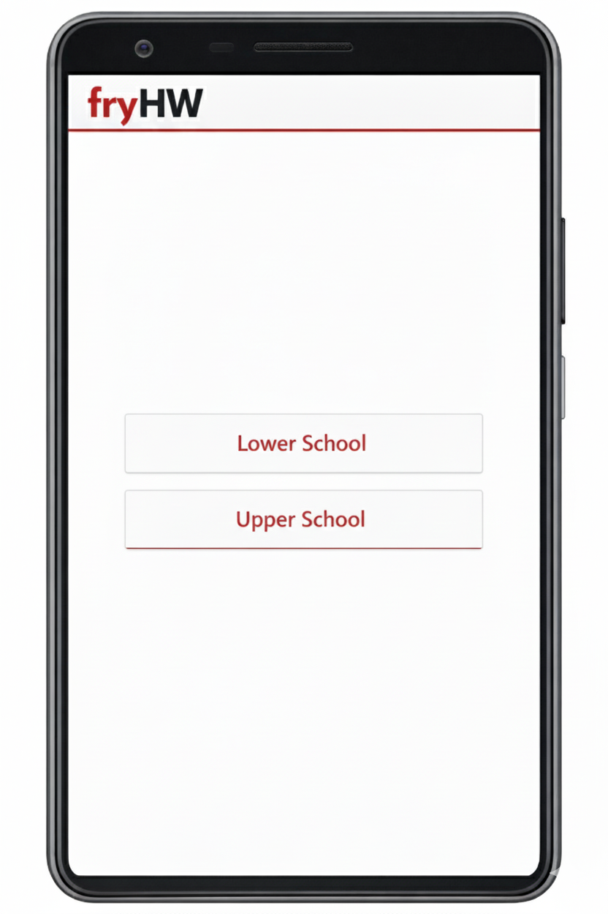
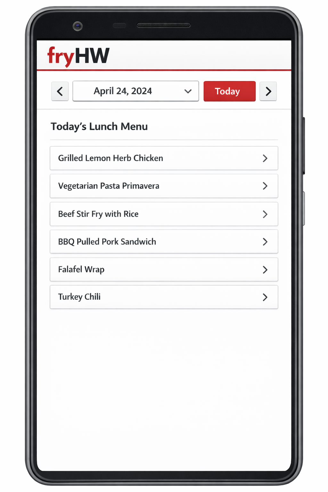
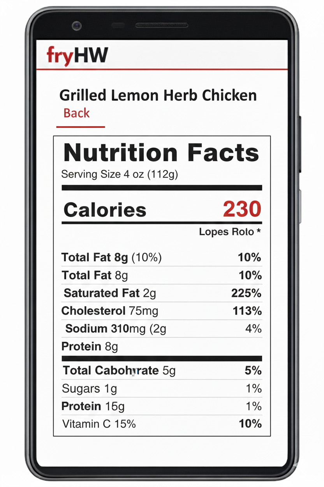

# fryHW

## Overview

fryHW is a web/mobile application that lists the nutrition facts of all meals served in the Harvard-Westlake cafeteria. It provides facts for the options available on any given day at HW, allowing students to make healthy choices.

---

## 1. Project Choice

* **Option**: Web Application Design
* **Application Title**: “fryHW”

---

## 2. Purpose of the Application

* **Goal**: Allow students to easily view basic nutritional information for the hot lunches served in the HW cafeteria. All food products in the cafeteria that do not have nutritional information printed on them will be included. Other cafeteria products with nutritional information already printed need not be included. There already exist certain apps that can estimate nutrition facts from a photo of food; however, these apps are limited in their accuracy and cannot show you what food will be available at HW in the coming days. fryHW can provide more accurate information and allow for future dietary planning. The app will be available on mobile devices, but since students are banned from using phones on campus, it will also be available online for use on a computer.

* **Target Audience**: Anyone who regularly eats at the HW cafeteria may find this app useful. Athletes in particular may be interested in carefully planning their diets with this app.

---

## 3. Design

### A. Aesthetics

**a. Theme**: Modern theme, mirroring existing HW apps including [hw.com](https://www.hw.com) and iHW.

**b. Color Scheme**: Primarily red, black, and white.

**c. Typography**: Clear, modern fonts; i.e. Cabrion

**d. Layout**: The center of the screen contains a list of all the foods being served in the cafeteria that day. The user can swipe left or right (or click the left/right buttons) to view meals for the previous and following days. There is a date selector at the top, so the user can input a date and jump to that point, next to a “Today” button that brings the user to the current day. Selecting a food item brings the user to another screen, listing all standard nutrition facts. The user can return to the main page by clicking a “Back” button.

### B. Functionality

**a. Core Features**: The user is presented with standard nutrition information – including total calories, sugar content, protein content, serving size, and more – for all hot meals and unlabeled food products served in the cafeteria. The user can view the lunch menu for any given day, including all nutrition information.

**b. User Flow**: Upon opening the website/app, the user is able to select either the Lower School or Upper School lunch menu. They are then immediately presented with today’s lunch menu. They can proceed to select and view nutritional information for any lunch item or view the menu for a different day. In the case of a meal with different options (vegan, etc.) the options will be displayed in a list when the meal is selected; upon choosing an option, the nutrition facts are displayed.

**c. Interactive Elements**: The user can view the menu for different days by swiping, tapping the left/right buttons, or by selecting a date in the top menu. Each menu item can be expanded by clicking on it, at which point nutritional information is shown.

---

## 4. Visual Sketches

*This image was generated with Gemini.*

*This image was created with ChatGPT.*

*This image was created with Gemini.*